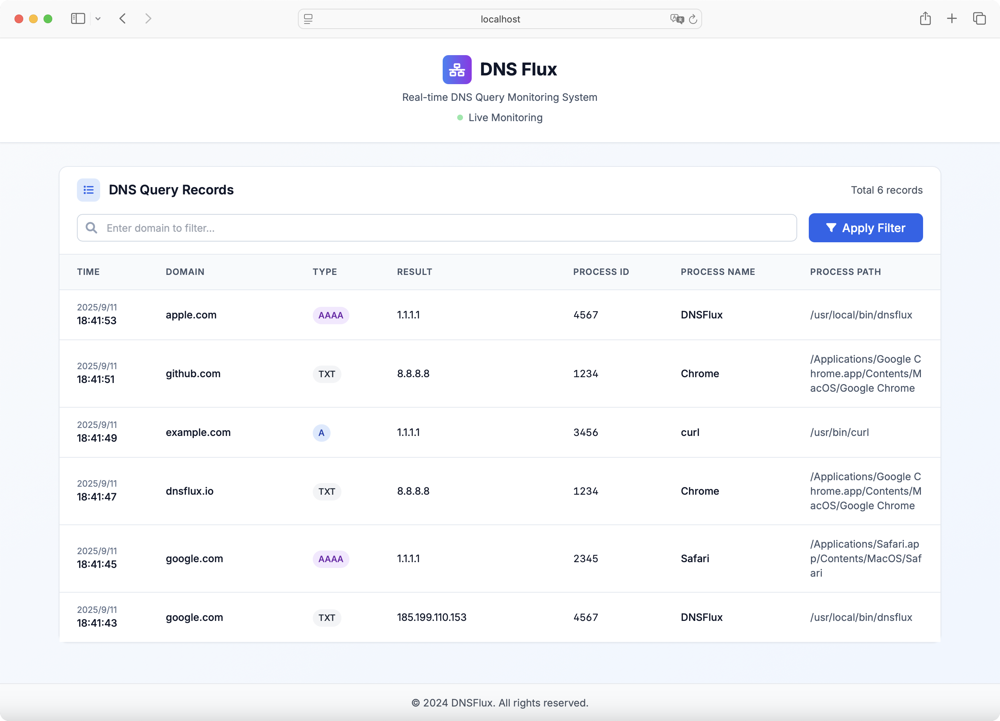

<div align="center">
<h1>DNS Flux</h1>

<p>Cross-platform DNS query monitoring tool for Windows and Linux systems</p>

<p>
  <a href="https://mit-license.org/">
    
  </a>
  <a href="https://github.com/whoopscs/dnsflux">
    
  </a>
  <a href="https://github.com/whoopscs/dnsflux">
    
  </a>
  <a href="https://github.com/whoopscs/dnsflux/releases">
    
  </a>
</p>

<div>

English ｜ [中文](README_CN.md)

</div>
</div>

---

## 📖 Project Overview

DNSFlux is a high-performance cross-platform DNS query monitoring tool designed for network security analysis, incident response, and malicious domain detection. By monitoring DNS query requests in real-time and recording detailed process information, it helps security analysts quickly locate malicious programs and suspicious network activities.

### 🎯 Core Value

- **Incident Response Support**: Quickly locate compromised hosts through malicious domain detection
- **Process Correlation Analysis**: Record process information for DNS queries to assist in malicious program identification
- **Real-time Monitoring**: Provides both command-line and web interface monitoring modes
- **Cross-platform Compatibility**: Supports mainstream Windows and Linux operating systems

## 🏗️ Technical Architecture

### Windows Platform
- **Technology Stack**: Based on ETW (Event Tracing for Windows) event tracing
- **Data Source**: Microsoft-Windows-DNS-Client provider
- **Event Type**: Captures completed query events with ID 3008
- **Permission Requirements**: Can run with normal user privileges

### Linux Platform
- **Technology Stack**: Based on eBPF (Extended Berkeley Packet Filter) technology
- **Data Source**: Kernel network packet capture and parsing
- **Monitoring Points**: udp_sendmsg and tcp_sendmsg system calls
- **Permission Requirements**: Requires root privileges or privileged mode
- **Kernel Requirements**: 
  - Kernel version >= 5.8 (recommended for best CO-RE support)
  - BTF (BPF Type Format) support enabled (CONFIG_DEBUG_INFO_BTF=y)
  - Kernel debug information packages installed
  - eBPF support enabled (CONFIG_BPF_SYSCALL=y)

### System Components

```
┌─────────────────┐    ┌──────────────────┐    ┌─────────────────┐
│ Platform        │───▶│   Memory         │───▶│   Web Server    │
│ Collector       │    │   Storage        │    │   (HTTP API)    │
│ (ETW/eBPF)      │    │   (Ring Buffer)  │    │                 │
└─────────────────┘    └──────────────────┘    └─────────────────┘
         │                       │                       │
         ▼                       ▼                       ▼
┌─────────────────┐    ┌──────────────────┐    ┌─────────────────┐
│   DNS Query     │    │   Console        │    │   Web           │
│   JSON Logs     │    │   Output         │    │   Interface     │
│                 │    │   Real-time      │    │   Dashboard     │
└─────────────────┘    └──────────────────┘    └─────────────────┘
```

## ✨ Features

### 🔍 DNS Monitoring
- **Real-time Capture**: Monitor all DNS query requests (A, AAAA, CNAME, MX, etc.)
- **Process Correlation**: Record process name, path, and PID that initiated the query
- **Query Details**: Include query domain, type, result, and response time
- **Status Tracking**: Monitor query success, failure, and error states

### 📊 Data Output
- **Console Output**: Real-time display of formatted DNS query logs
- **JSON Storage**: Automatically save query records to JSON files
- **Web Interface**: Provide modern visualization monitoring dashboard
- **Memory Cache**: Efficient ring buffer storage (default 5000 records)

### 🌐 Web Interface
- **Real-time Data Table**: Dynamically display DNS query records
- **Search & Filter**: Support multi-field search for domains, process names, etc.
- **Data Statistics**: Display total record count and real-time statistics
- **Responsive Design**: Compatible with desktop and mobile devices

### ⚙️ Configuration Options
- **Command Line Parameters**: Support rich startup parameter configuration
- **Environment Variables**: Support configuration through environment variables
- **Log Levels**: Adjustable log output levels (debug, info, warn, error)
- **Network Configuration**: Customizable web service listening address and port

## 🚀 Quick Start

### System Requirements

**Windows**
- Windows 10/11 or Windows Server 2016+
- .NET Framework 4.5+ (usually pre-installed)
- Normal user privileges

**Linux**
- Linux kernel 4.4+ (eBPF support required)
- Root privileges or sudo access
- Modern Linux distributions (Ubuntu 18.04+, CentOS 7+, Debian 9+)

### Installation Methods

#### Method 1: Download Pre-compiled Binaries

1. Visit the [Releases page](https://github.com/whoopscs/dnsflux/releases)
2. Download the executable file for your platform
3. Extract and run

#### Method 2: Build from Source

```bash
# Clone repository
git clone https://github.com/whoopscs/dnsflux.git
cd dnsflux

# Install dependencies
go mod download

# Build
go build -o dnsflux ./cmd/dnsflux

# Or use build script
chmod +x scripts/build.sh
./scripts/build.sh
```

### Usage

#### Basic Usage

**Windows**
```cmd
# Console mode
dnsflux.exe

# Web interface mode
dnsflux.exe -w
```

**Linux**
```bash
# Console mode
sudo ./dnsflux

# Web interface mode
sudo ./dnsflux -w
```

#### Advanced Configuration

```bash
# Custom web service configuration
dnsflux -w -a 0.0.0.0 -p 8080

# Set log level
dnsflux -w -l debug

# Complete parameter example
dnsflux --web --addr=0.0.0.0 --port=8080 --log-level=info
```

#### Environment Variable Configuration

```bash
export DNSFLUX_ENABLE_WEB=true
export DNSFLUX_HOST=0.0.0.0
export DNSFLUX_PORT=8080
export DNSFLUX_LOG_LEVEL=info

dnsflux
```

### Command Line Parameters

| Parameter | Short | Default | Description |
|-----------|-------|---------|-------------|
| `--web` | `-w` | `false` | Enable web service |
| `--addr` | `-a` | `127.0.0.1` | Web service listening address |
| `--port` | `-p` | `58080` | Web service listening port |
| `--log-level` | `-l` | `info` | Log level (debug/info/warn/error) |
| `--help` | `-h` | - | Show help information |

## 📸 Interface Preview

### Web Monitoring Interface


### Console Output
```
2024-01-15 14:30:25 [INFO] DNSFlux starting...
2024-01-15 14:30:25 [INFO] Version: v1.0.0
2024-01-15 14:30:25 [INFO] DNSFlux Web panel started, visit http://127.0.0.1:58080 to view web interface
2024-01-15 14:30:25 [INFO] Current platform: windows/amd64
2024-01-15 14:30:25 [INFO] Starting Windows ETW DNS Collector

[2024-01-15 14:30:26] chrome.exe (PID: 1234) -> example.com (A) -> 93.184.216.34
[2024-01-15 14:30:27] firefox.exe (PID: 5678) -> github.com (A) -> 140.82.112.3
```

## 🔧 Development Guide

### Project Structure

```
dnsflux/
├── cmd/dnsflux/           # Main program entry
├── internal/
│   ├── collector/         # Platform collectors
│   │   ├── linux/        # Linux eBPF implementation
│   │   └── windows/      # Windows ETW implementation
│   ├── model/            # Data models
│   ├── store/            # Storage layer
│   └── web/              # Web service
├── pkg/
│   ├── flag/             # Command line parameters
│   └── logger/           # Logging components
├── scripts/              # Build scripts
└── web/                  # Frontend resources
```

### Build Requirements

- Go 1.19+
- Linux: Kernel with eBPF support
- Windows: ETW support required

### Dependency Management

Main dependencies:
- `github.com/cilium/ebpf` - Linux eBPF support
- `github.com/0xrawsec/golang-etw` - Windows ETW support
- `github.com/sirupsen/logrus` - Structured logging
- `github.com/gin-gonic/gin` - Web framework

## 🤝 Contributing

We welcome community contributions! Please follow these steps:

1. Fork this repository
2. Create a feature branch (`git checkout -b feature/AmazingFeature`)
3. Commit your changes (`git commit -m 'Add some AmazingFeature'`)
4. Push to the branch (`git push origin feature/AmazingFeature`)
5. Open a Pull Request

### Development Standards

- Follow Go coding conventions
- Add appropriate test cases
- Update relevant documentation
- Ensure cross-platform compatibility

## 📄 License

This project is licensed under the [MIT License](./LICENSE).

## ⚠️ Disclaimer

This tool is for educational purposes and authorized security testing environments only. Unauthorized access or use of systems that do not belong to you is illegal. The author is not responsible for any misuse of this tool.

## 💖 Support the Project

❤️ If you like this project, give it a ⭐ and share it with friends!

---

## 📊 Star History

<div align="center">

[](https://star-history.com/#whoopscs/dnsflux&Date)

</div>
